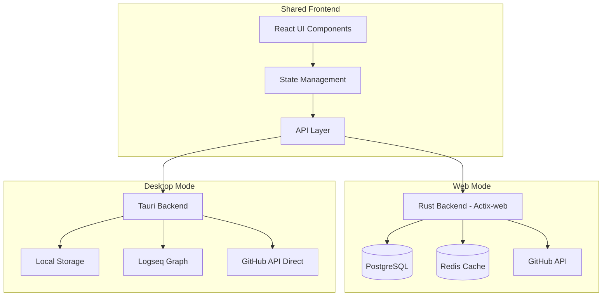

# Personal GitHub Dashboard Architecture

## Overview

Personal GitHub Dashboard is designed as a hybrid application that can run in two modes:

1. Web Application Mode (Server-based)
2. Desktop Application Mode (Tauri-based)

This document outlines the architectural decisions and patterns used to support both modes while maintaining a consistent user experience.

## System Architecture

## Component Architecture

### 1. Frontend Layer (Shared)

- **Technology**: React + TypeScript
- **Key Components**:
  - Shared UI components
  - Environment-aware API client
  - Mode-specific feature toggles
  - Unified state management

### 2. Web Backend (Server Mode)

- **Technology**: Rust + Actix-web
- **Components**:
  - RESTful API endpoints
  - Database operations
  - Caching layer
  - GitHub API integration
  - Authentication service

### 3. Desktop Backend (Tauri Mode)

- **Technology**: Rust + Tauri
- **Components**:
  - Local storage management
  - Logseq integration
  - Offline capabilities
  - System integration
  - Local GitHub API client

## Data Flow

### Web Mode

1. User interacts with React UI
2. API request sent to Actix-web backend
3. Backend processes request:
   - Checks Redis cache
   - Queries PostgreSQL if needed
   - Makes GitHub API calls
4. Response returned to frontend
5. UI updates with new data

### Desktop Mode

1. User interacts with React UI
2. API request handled by Tauri backend
3. Backend processes request:
   - Checks local storage
   - Makes direct GitHub API calls
   - Integrates with Logseq if needed
4. Response returned to frontend
5. UI updates with new data

## Authentication

### Web Mode

- GitHub OAuth flow
- Session-based authentication
- Token storage in database
- Redis session cache

### Desktop Mode

- Personal Access Token (PAT)
- Secure local storage
- Token encryption
- Offline token validation

## Data Storage

### Web Mode

- **PostgreSQL Database**:
  - User data
  - GitHub data cache
  - Analytics data
  - Application state
- **Redis Cache**:
  - Session data
  - API response cache
  - Rate limit tracking

### Desktop Mode

- **Tauri Secure Store**:
  - User preferences
  - GitHub PAT
  - Local cache
- **Local File System**:
  - Logseq notes
  - Offline data
  - Backup data

## Integration Points

### GitHub API

- Web: Server-side integration with caching
- Desktop: Direct Octokit integration
- Shared rate limit handling
- Error handling strategies

### Logseq (Desktop Only)

- Local graph access
- Note reading/writing
- Markdown processing
- Graph visualization

## Security Considerations

### Web Mode

- HTTPS enforcement
- CSRF protection
- Rate limiting
- SQL injection prevention
- XSS protection

### Desktop Mode

- Secure storage encryption
- Local file security
- API key protection
- Update verification

## Performance Optimization

### Web Mode

- Redis caching
- Database indexing
- Query optimization
- Load balancing ready

### Desktop Mode

- Local caching
- Efficient file I/O
- Memory management
- Background processing

## Error Handling

### Web Mode

- Global error middleware
- Structured error responses
- Logging and monitoring
- Recovery strategies

### Desktop Mode

- Offline error handling
- Sync conflict resolution
- Local storage fallbacks
- Update retry logic

## Testing Strategy

### Shared Components

- Unit tests for UI
- Integration tests
- State management tests
- API client tests

### Web-Specific

- API endpoint tests
- Database operations
- Cache behavior
- Load testing

### Desktop-Specific

- Tauri plugin tests
- Storage tests
- Offline functionality
- Cross-platform tests

## Deployment

### Web Mode

- Docker containerization
- Database migrations
- Cache warming
- SSL configuration

### Desktop Mode

- Cross-platform builds
- Auto-updates
- Installation packages
- Platform-specific configs
